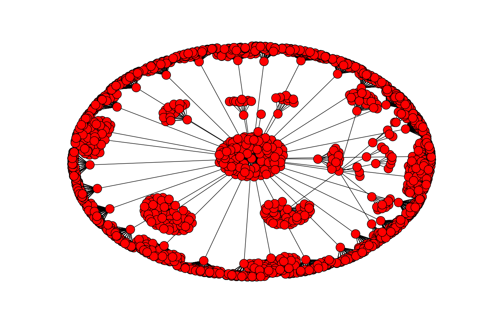
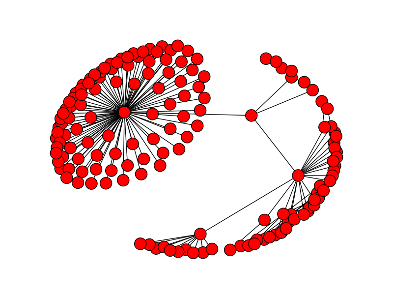

<h2>A Web Crawler and Network Visualizer in Python.</h2>
The program crawls the given website by following anchor tags using Breadth First Search.

<b>Usage:</b>

python main.py <http://www.example.com>

<b>Features:</b>
- Creates a list of all pages indexed on a website
- Creates a list of indexed pages with their relative depths and respective predecessors
- Creates an image of the website network
- Saves the indexed URLs to a JSON file
- Added robustness to handle complex data parsing and broken hyperlinks
- Added limits for maxdepth and maxpages indexed

<b>Requirements:</b>
- <a href = "http://docs.python-requests.org/en/latest/">Requests</a> or Requests[Security] to allow a true SSL connections
- <a href = "https://docs.python.org/3/library/json.html">JSON</a> library
- <a href = "http://matplotlib.org/api/pyplot_api.html">Matplotlib</a> to allow plotting the graph
- <a href = "https://networkx.github.io/">Networkx</a> to create the Graph using the list data

<b>An image of codeacademy.com Network:</b>

<b>An image of google.com Network:</b>

<b>TODO :</b>

Add functionality for parsing links that don't start with http
i.e. Support for relative links (href = "/source")

Add functionality to limit crawling to links that are subdomains of the input URL.

Author - bagarwa2